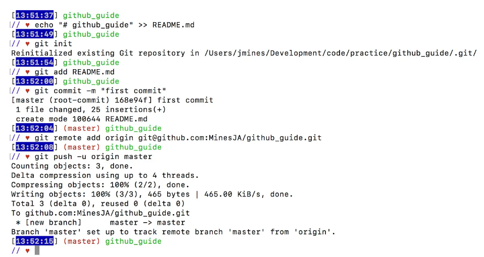
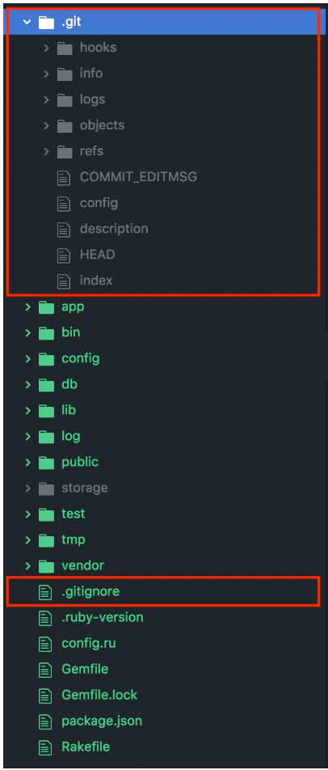

# GitHub Collaboration Guide

This guide explains how to collaborate on a project using GitHub. Follow these instructions to set up and manage group projects.

## Table of Contents
1. Initializing a New Project
2. Setting Up Your Team
3. Collaborating with Branches
4. Submitting a Pull Request
5. Merging a Pull Request

   ## Initializing a New Project

   **Create a Local Repository**:
   - Open IntelliJ and create a new project.
   - Click the `Terminal` icon on the bottom left. Click the `New Predefined Session` dropdown and choose `Git Bash`.
   - Create a local git repository by entering git init.
   - ``` bash
      git init
      ```
   **Create a New GitHub Repository**:
   - Go to GitHub, click the `+` button, and select **New Repository**.
   - Enter the repository name and description.
   - Select public or private visibility based on your team’s needs.
   - Do **not** initialize with a `README.md`. You will create that manually later.
   - Click **Create Repository**.
  
   **Link Your Local Repository to GitHub**:
   - Copy the repository URL from GitHub.
   - In your Git Bash, run:
     ```bash
     git remote add origin <repository-url>
     git branch -M main
     git push -u origin main
     ```
     *Found on GitHub project home page*

     Your Git Bash should look like this when you’re done:

     

   This adds a ‘.git’ folder to your repo, connects you to your remote Github Repo and also gives you a ‘.gitignore’ file.
   
   

   And if you go to your Github Repo page and refresh, you’ll see the ReadMe that you intialized with and the reference to the first commit you made.

## Set up your team
Click on the "Settings" tap of your rep, then "Collaborators" then search for GitHub users and add them by clicking "Add Collaborators":


They will receive an email letting them know you added them and will be listed as a collaborator:


     
